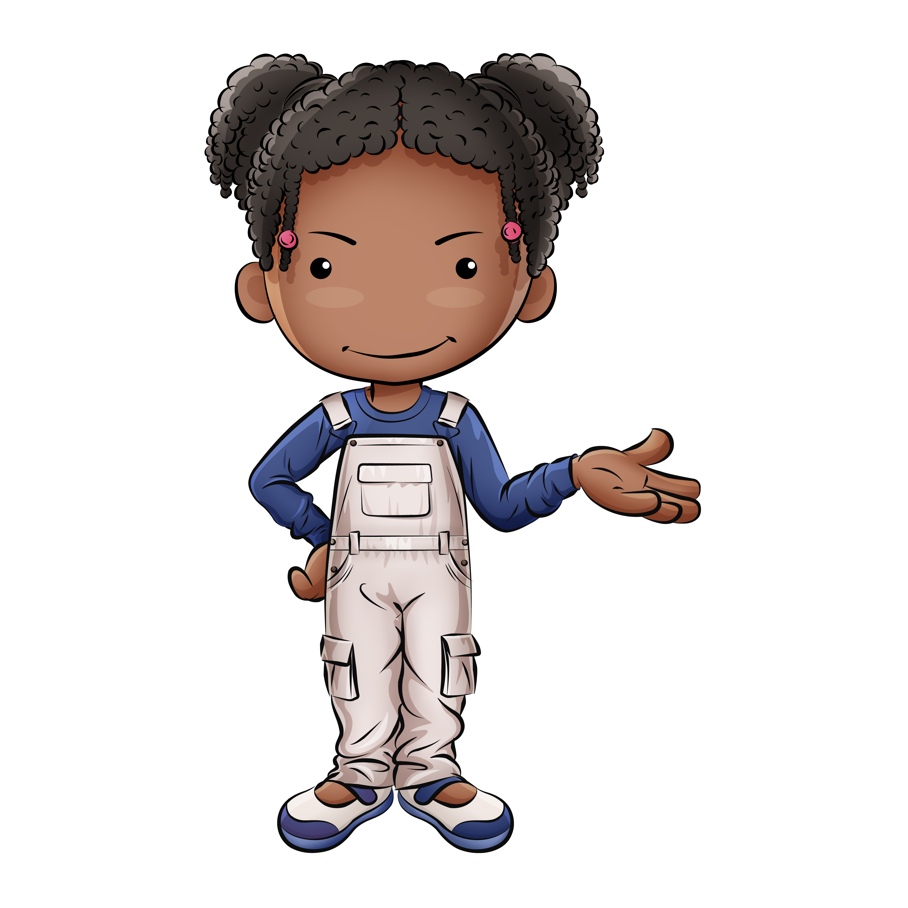

# Coding with Coda Array!

Coda Array is an coding journal-app for indvidiuals learning to code. This particluar app uses characters to narrate the functionality and each character is a member of a marginalized group to promtote STEM in various communities. The guide is Coda Array, a little girl who is also learning how to code and also keeps up her journal. This app uses JavaScript, Express.js, MongoDb, Mongoose, Morgan, Node.js and OAuth via Google.

## Screenshots 

## Technologies 
- JavaScript
- Express.js
- MongoDb
- Mongoose
- Morgan
- Node.js
- OAuth via Google
- Materialize

## Getting Started

To use the prototype, use the following link: [Click Here](https://coda-journal.herokuapp.com)

## Coming Soon
- User will be able to veiw other user's page, but not edit them.
- User will view a more seamless design.
- UX will improve via hover information on all functions
- UI will improve via OAuth via Twitter & Facebook for ease of login.
- User will be able to edit skills.
- User will be able to veiw resources to learn code.
- User will be able to "follow" other users' journals.
- User will have a profile picture, default will be the profile pic via the authentication route user used to login.
- User will have access to articles about coding languages, tricks & tips, and people-to-watch in STEM.
- User can view the app in Spanish & French.

